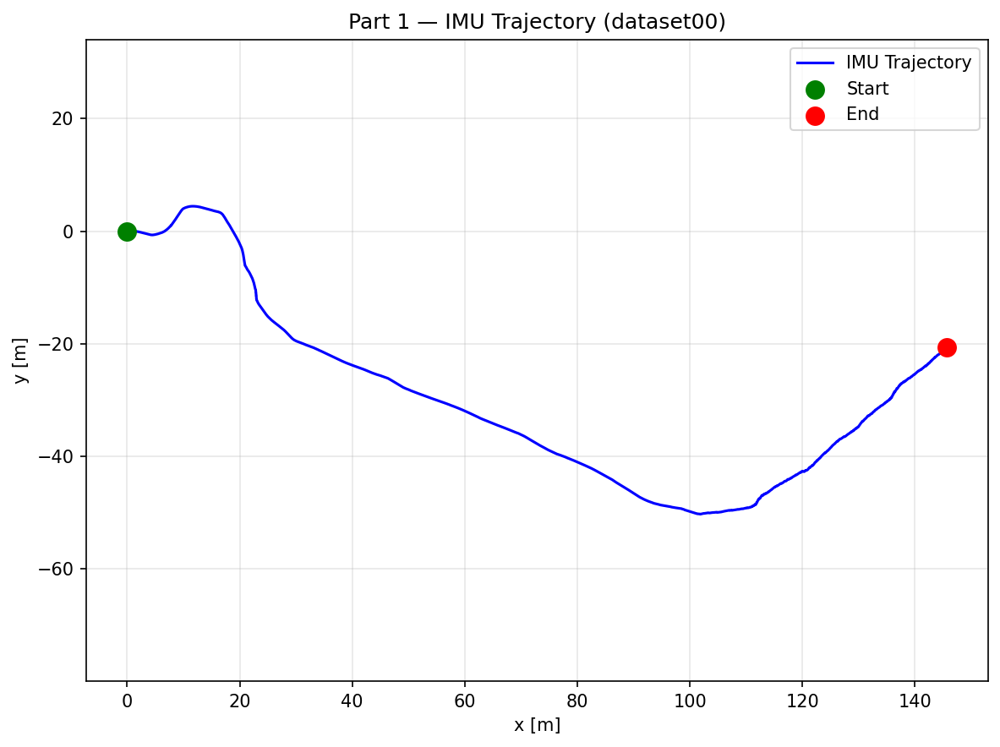
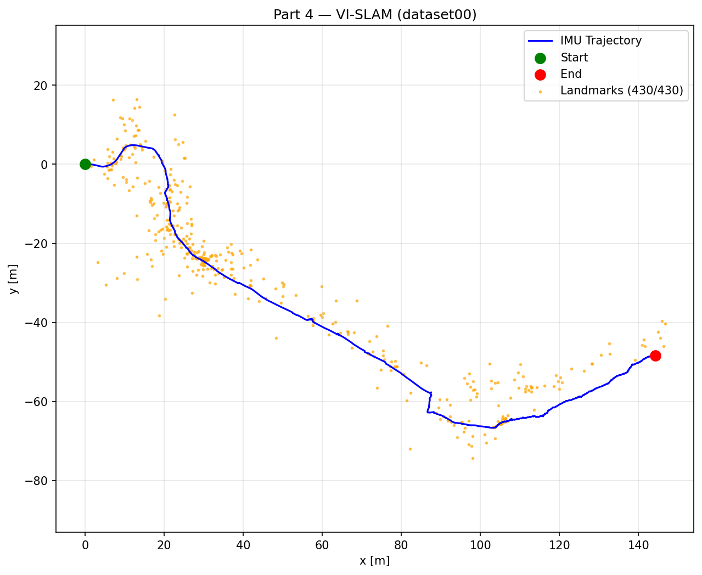
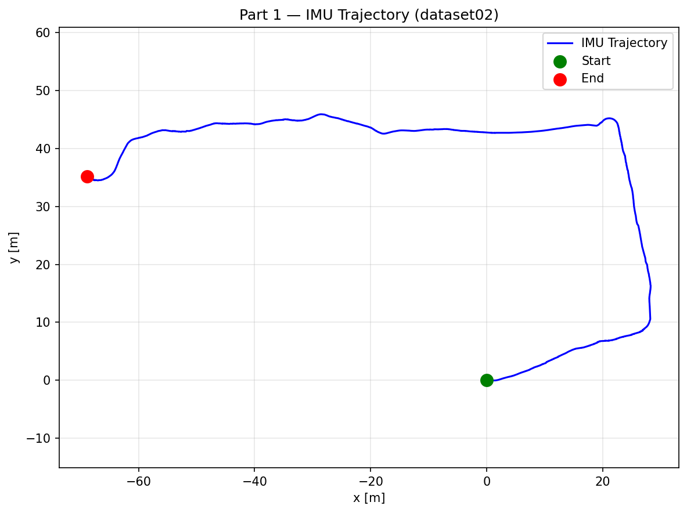
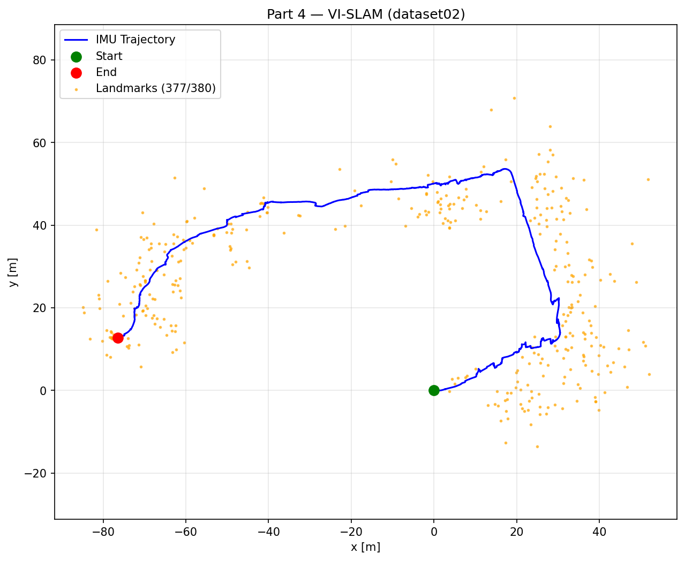

# Visual-Inertial SLAM with an Extended Kalman Filter on SE(3)

**Fusing IMU kinematics with stereo-camera landmark observations to recover a vehicle's trajectory and a 3D landmark map from real driving data — implemented from scratch in Python.**

<p align="center">
  
</p>
<p align="center"><em>
Dataset 01 (~100 m loop, 2× speed). Left: dead-reckoned IMU trajectory. Center: EKF landmark mapping along the fixed IMU path. Right: full VI-SLAM — stereo landmark updates continuously correct the pose as the map is built.
</em></p>

<p align="center">
  
</p>
<p align="center"><em>
Dataset 00 (~150 m U-shaped path, 2× speed). The joint filter (right) reconstructs both the trajectory and 430 landmarks; visual corrections reshape the path noticeably compared to the IMU-only estimate (left).
</em></p>

**[Read the full technical report (PDF)](ECE276A_PR3/project3_report_uploaded.pdf)**

---

## Overview

This project implements a complete **visual-inertial SLAM** system: given only body-frame linear/angular velocity measurements from an IMU and pixel coordinates of tracked visual features from a calibrated stereo camera, it estimates the vehicle pose $T_t \in SE(3)$ over time together with the 3D positions of landmarks $m \in \mathbb{R}^{3 \times M}$.

The system is built in three stages, each validated on three real driving sequences:

1. **IMU localization** — EKF prediction with the pose evolving on the $SE(3)$ Lie group
2. **Landmark mapping** — EKF update of landmark positions from stereo observations, given the IMU trajectory
3. **Visual-inertial SLAM** — joint estimation of pose and landmarks with pose–landmark cross-covariances, closing the loop between prediction and correction

The core challenge is that IMU dead reckoning drifts unboundedly as velocity noise integrates over time, while stereo depth is noisy at small disparity. The EKF fuses the two complementary sensors: the IMU provides smooth short-term motion, and re-observed landmarks supply the geometric constraints that pull accumulated drift back out of the trajectory.

## Technical approach

### 1. IMU localization — EKF prediction on SE(3)

The pose is propagated with the $SE(3)$ exponential map, keeping the estimate on the manifold by construction:

```math
T_{t+1} = T_t \exp\!\big(\tau_t\,\hat{\xi}_t\big), \qquad \xi_t = \begin{bmatrix} v_t \\ \omega_t \end{bmatrix}
```

The 6×6 pose covariance is propagated in the Lie algebra using the adjoint of the twist:

```math
\Sigma_{t+1} = F_t\, \Sigma_t\, F_t^\top + W\tau_t, \qquad F_t = \exp\!\big(-\tau_t\, \text{ad}_{\xi_t}\big)
```

As expected, this dead-reckoned trajectory is smooth but drifts over long sequences — the motivation for the visual update.

### 2. Landmark mapping — EKF update with a stereo observation model

With the trajectory fixed, each landmark is estimated independently:

- **Initialization** by stereo triangulation (DLT/SVD) with strict quality gates: minimum disparity, depth clamped to a plausible range (0.3–150 m), and a reprojection-error check that rejects degenerate geometry.
- **Update** with the stereo projection model $z = h(T_t, m_j) \in \mathbb{R}^4$ (left + right pixel coordinates) and its analytic 4×3 Jacobian with respect to the landmark position.
- Missing observations (encoded as −1) are skipped; landmarks are only updated when actually observed.

### 3. Visual-inertial SLAM — joint pose and landmark estimation

The full filter maintains the pose covariance $\Sigma_{TT}$ (6×6), a per-landmark covariance $\Sigma_{m_k}$ (3×3), and pose–landmark cross-terms $\Sigma_{Tm_k}$ (6×3). Compared to a dense $(6+3M)\times(6+3M)$ covariance, this block structure reduces memory from $O(M^2)$ to $O(M)$ and made the filter both fast and numerically stable in practice.

Each timestep runs:

1. IMU prediction of $T_t$, $\Sigma_{TT}$, and propagation of all cross-terms
2. Triangulation of newly visible landmarks
3. A **sequential EKF update** over a subsample of visible landmarks, using both the pose Jacobian $H_T$ (4×6, via the $\odot$ operator) and the landmark Jacobian $H_m$ (4×3)

Robustness required several deliberate design decisions:

- **Two-stage outlier gating** — an $L_\infty$ innovation gate rejects gross feature-tracking failures cheaply, then a **chi-squared Mahalanobis gate** ($\chi^2_4$, tuned per dataset at 90–99%) rejects statistically inconsistent observations against the full innovation covariance.
- **Warm-up window** — camera corrections to the pose are disabled for the first ~50–80 steps until the filter covariance is informative, preventing early over-correction.
- **Clipped, averaged pose correction** — per-feature pose increments are norm-clipped, accumulated across the timestep, and applied once as a single averaged $SE(3)$ retraction $T \leftarrow T\exp(\hat{\delta\xi})$. This eliminated the jerky per-feature jumps of a naive sequential update.
- **Per-dataset noise presets** — process noise ($W_v$, $W_\omega$) and pixel observation variance are configured per sequence, trading IMU trust against camera trust.

### Extra: optical-flow feature front-end

For the sequence without precomputed features, a stereo feature-tracking front-end was built with OpenCV: Shi–Tomasi corner detection, pyramidal Lucas–Kanade optical flow for both left→right stereo matching and frame-to-frame temporal tracking, and a **forward–backward consistency check** to discard unreliable tracks.

## Results

<p align="center">
  
</p>
<p align="center"><em>
Dataset 02 (~250 m, 2× speed) — the longest sequence, run with retuned process noise and gating thresholds. The VI-SLAM panel (right) shows visual updates actively reshaping the trajectory relative to dead reckoning (left).
</em></p>

Without ground truth, evaluation is qualitative — the key comparison is IMU-only dead reckoning versus the full filter on the same data:

<table>
  <tr>
    <th width="50%">IMU-only dead reckoning (Part 1)</th>
    <th width="50%">Full VI-SLAM (Part 4)</th>
  </tr>
  <tr>
    <td></td>
    <td></td>
  </tr>
  <tr>
    <td></td>
    <td></td>
  </tr>
</table>
<p align="center"><em>
Left column: integrating IMU velocities alone. Right column: the same sequences with stereo landmark corrections — the filter recovers a consistent map (orange) while adjusting the path where visual evidence disagrees with dead reckoning.
</em></p>

Verified outcomes across the three sequences:

| Sequence | Path | Landmarks initialized (VI-SLAM) | Observation |
|---|---|---|---|
| dataset00 | ~150 m U-shaped path | 430 / 430 selected features | Visual updates substantially reshape the second half of the trajectory |
| dataset01 | ~100 m loop | 401 / 403 selected features | Mapped landmarks align tightly with the driven path |
| dataset02 | ~250 m path | 377 / 380 selected features | Longest sequence; stable filtering with retuned noise and gating |

Qualitative findings, consistent with the report: the IMU-only trajectory drifts as noise integrates; landmark mapping produces a map that follows the motion with some outliers from imperfect feature tracks; and the joint filter yields a visibly more consistent trajectory as re-observed landmarks correct accumulated error. Landmark depth remains the noisiest component, as expected when disparity is small.

## Key contributions

- **Full EKF SLAM stack from scratch** — SE(3) Lie-group prediction, DLT stereo triangulation, analytic pose and landmark Jacobians, and the joint update, all in NumPy/SciPy without any SLAM library.
- **Scalable covariance design** — replaced the textbook dense $3M \times 3M$ landmark covariance with per-landmark 3×3 blocks plus 6×3 pose cross-terms, propagated in a single vectorized `einsum`, making hundreds of landmarks tractable and numerically stable (covariances are re-symmetrized after every update).
- **Robust estimation in the loop** — layered $L_\infty$ and Mahalanobis gating, triangulation quality filters, warm-up scheduling, and clipped/averaged pose retraction, each addressing a concrete failure mode observed during development.
- **A stereo visual front-end** — Shi–Tomasi + pyramidal LK tracking with bidirectional consistency checking, used where precomputed features were unavailable.
- **Reproducible experiment tooling** — a single CLI (`main.py`) that runs any stage on any dataset with per-dataset noise presets, saves all estimates as `.npz`/`.npy` artifacts, and regenerates every figure; plus a blit-accelerated OpenCV renderer (`trajectory_video.py`, ~10 ms/frame) that produces the three-panel trajectory animations shown above.

## Engineering highlights

- Geometry-aware convention handling: the code **auto-detects whether the camera's optical axis is x or z** from the extrinsic calibration, so the same projection/Jacobian code runs on datasets with different frame conventions.
- Efficient SE(3) utilities: closed-form $SE(3)$ inverse, hat/curly-hat/adjoint operators, and the $\odot$ operator for pose Jacobians.
- Failure-tolerant numerics: singular innovation covariances and degenerate triangulations are detected and skipped rather than crashing the filter.
- Every experiment is deterministic given its config: noise presets, gating thresholds, and feature budgets live in one place (`NOISE_PRESETS` / `SLAM_PARAMS` in `main.py`).

**Stack:** Python · NumPy · SciPy · OpenCV · Matplotlib

## Repository layout & quick start

```
ECE276A_PR3/
├── project3_report_uploaded.pdf   # technical report
└── code/
    ├── main.py                # CLI entry point — runs any/all stages
    ├── pr3_utils.py           # SE(3) math, stereo model, Jacobians, triangulation
    ├── imu_localization.py    # Part 1: IMU EKF prediction
    ├── landmark_mapping.py    # Part 3: landmark-only EKF
    ├── vi_slam.py             # Part 4: full VI-SLAM
    ├── feature_detection.py   # optical-flow stereo front-end (extra credit)
    ├── trajectory_video.py    # animated three-panel visualization renderer
    └── results/               # saved trajectories, maps, plots, and videos
```

```bash
pip install numpy scipy matplotlib opencv-python
python ECE276A_PR3/code/main.py path/to/dataset00 --part all   # or --part 1 / 3 / 4
```

Outputs (trajectory plots, landmark maps, and `.npz` result arrays) are written to `results/`. See [code/README.md](ECE276A_PR3/code/README.md) for the full CLI reference and data format.

## Limitations & future work

- Landmark depth is noisy at small stereo disparity; a RANSAC-based filter on feature tracks would remove more outliers before they enter the filter.
- Data association is taken from the provided feature tracks; robust association would help in feature-poor regions.
- A sliding-window bundle adjustment (or iterated EKF update) could refine the linearization the EKF commits to at each step.
